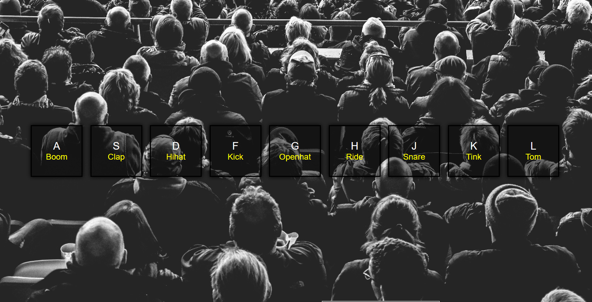
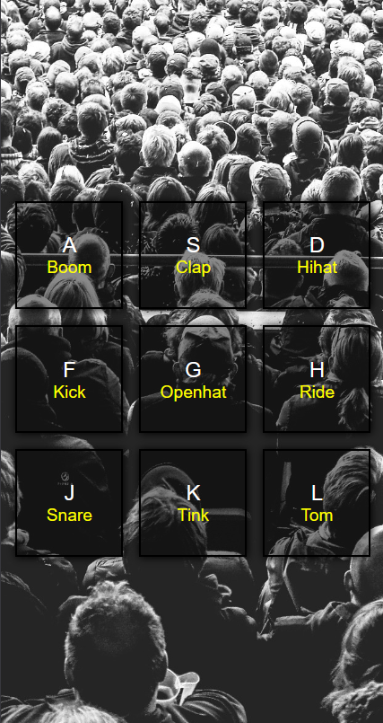

# Wes Bos Courses - Brum Kit solution 

## Table of contents

- [Overview](#overview)
  - [Screenshot](#screenshot)
  - [Links](#links)
- [My process](#my-process)
  - [Built with](#built-with)
  - [Useful resources](#useful-resources)
- [Author](#author)

## Overview
This is a solution to the [Drum Kit practice challenge](https://courses.wesbos.com/account/access/62f5161388db94aff3b2dab9/view/194130650).

### Screenshot

### Links
- Solution URL: [GitHub](https://github.com/ButchBet/JavaScript-Drum-Kit)
- Live Site URL: [Drum Kit](https://butchbet.github.io/JavaScript-Drum-Kit/)

### Built with
- Semantic HTML5 markup
- CSS custom properties
- Flexbox
- Mobile-first workflow
- JS vanilla

## Author
- Website - [Butchbet](none)
- Twitter - [@JustButchBet](https://twitter.com/JustButchBet)